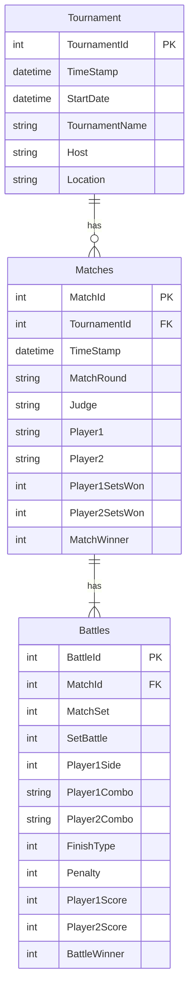

```mermaid
erDiagram
    Tournament ||--o{ Matches : has
    Matches ||--|{ Battles : has
    Tournament {
        int TournamentId PK
        datetime TimeStamp
        datetime StartDate
        string TournamentName 
        string Host
        string Location
    }
    Matches {
        int MatchId PK
        int TournamentId FK
        datetime TimeStamp
        string MatchRound
        string Judge
        string Player1
        string Player2
        int Player1SetsWon
        int Player2SetsWon
        int MatchWinner
    }
    Battles {
        int BattleId PK
        int MatchId FK
        int MatchSet
        int SetBattle
        int Player1Side
        string Player1Combo
        string Player2Combo
        int FinishType
        int Penalty
        int Player1Score
        int Player2Score
        int BattleWinner
    }
```